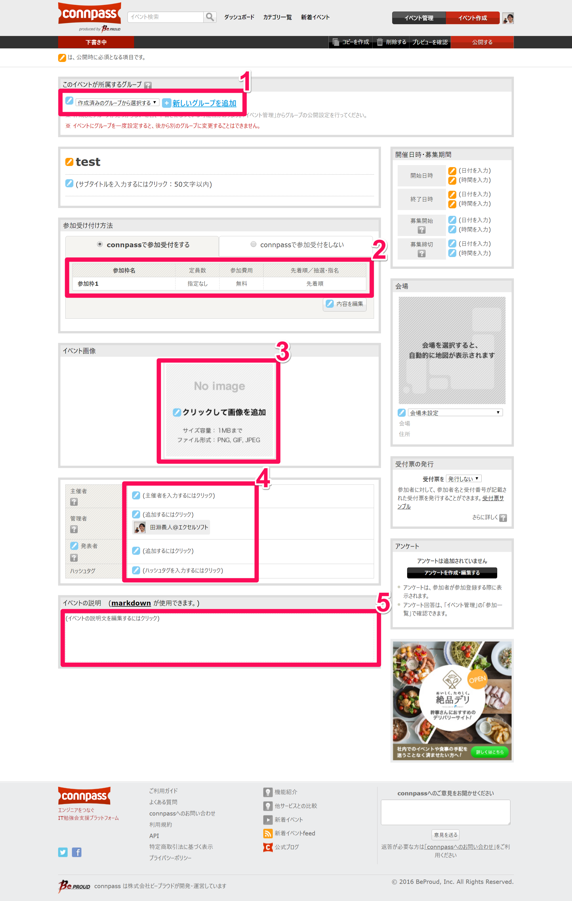

JUXG イベント作成




## 基本情報

1. 所属グループは`JXUG`にします。
1. 基本は`参加`、`参加＋懇親会`、`スタッフ(またはメンター)`の3枠にします。`参加`、`参加＋懇親会`の枠数は申し込み具合によって随時調整します。
1. [こちら](https://github.com/jxug/JXUG_Materials/blob/master/JXUG_Logo_Connpass.png)の画像をダウンロードしてアップロードします。
1. 主催者は`JXUG`にします。管理者は`JXUG`とそのイベントの管理者のConnpassアカウントを追加します。発表者に発表者のConnpassアカウントを追加します(これにより発表者自身が資料をアップできます)。ハッシュタグは`#JXUG`にします。

その他、日時、場所、受付票の有無、アンケートを用意します。(アンケートのひな型は作成中)

## イベントの説明

イベントの説明には、Markdownで情報を入力します。以下のテンプレートをご利用ください。

```
// 主催者からの挨拶をこちらに記載してください。

## 会の概要タグライン

// 今回の内容についての概要説明をこちらに記載してください。

## タイムスケジュール

| 時間 | 発表者 | 内容 |
|---|---|---|
| XX:XX | スタッフ集合 | |
| XX:XX | 開場（スピーカー、参加者入場開始）| |
| XX:XX - XX:XX | [@xxx](https://twitter.com/xxx) | 発表の内容 |
| XX:XX - XX:XX | 休憩 | |

// [【Copy to Markdown】Release 1.0.2.0 - nuits.jp blog](http://www.nuits.jp/entry/2016/10/26/111941) や [勉強会タイムテーブル生成シート - Xamarin 日本語情報](http://ytabuchi.hatenablog.com/entry/event-scheduler) を使用すると便利です。

## その他のアピール内容タグライン

登壇者募集、LT募集、環境構築のお願いなど、必要な連絡事項はこちらに。

## アンチハラスメントポリシー

JXUG では、アンチハラスメントポリシーを掲げています。参加されるすべての方は、以下のページのポリシーを順守いただきますよう、お願いいたします。

[JXUG : コミュニティポリシー](http://jxug.org/policy.html)

登壇者の方はできるだけ事前のスライドチェックを受けてください。ポリシーに抵触するような行為があった場合には、コミュニティ側から発表の中止などを行う場合がありますので、あらかじめご了承ください。

健全な運営にご協力をお願いいたします。

## 任意のカンパのお願い

現在 JXUG では、任意で一口 500円のカンパを募集しております。イベント中の軽食代、登壇者／スタッフの懇親会での割引や、遠方から来られた方へのお車代、有料会場の費用などに使用いたします。

```
